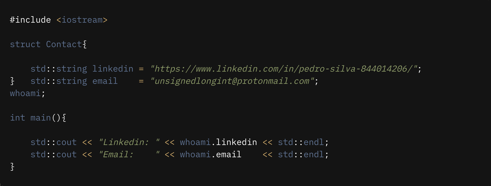

## Wassup! im demon-i386 :computer:
------------

   
 

        
 
            <ul>
                <li></li>
                <li></li>
                <li></li>
                <li></li>
                <li></li>
                <li></li>
                <li></li>
                <li><a href="https://app.hackthebox.eu/profile/412490"></li>
         </ul>
      

 

 

  
    

    <h3>Contacts</h3>
    
 

